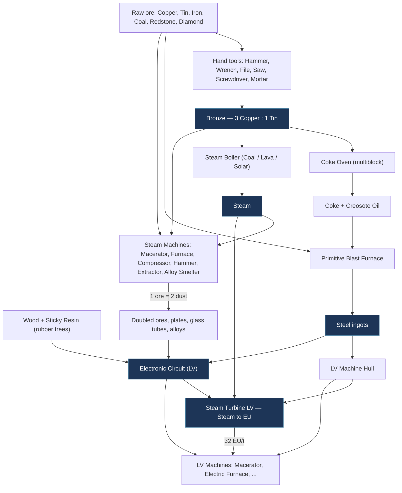
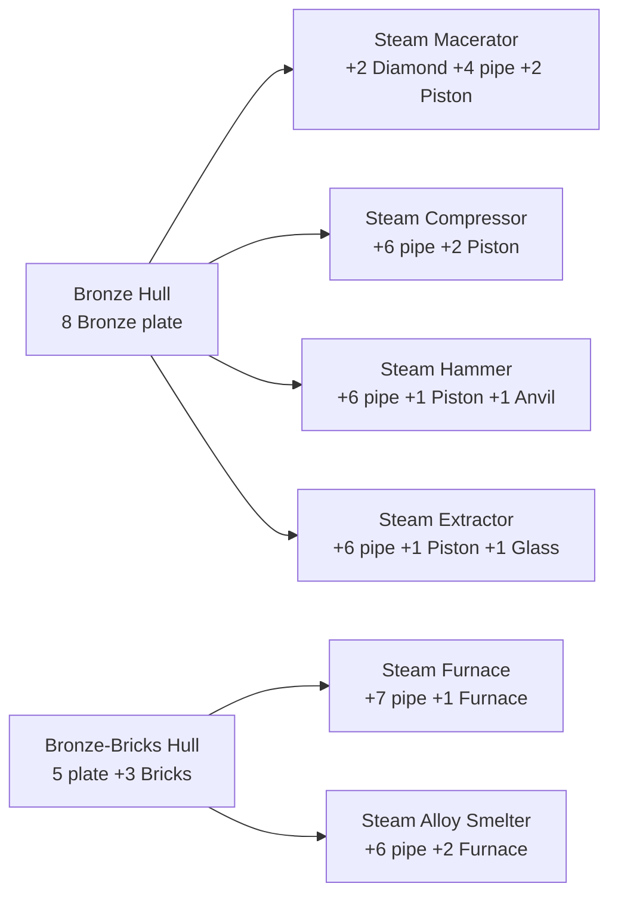
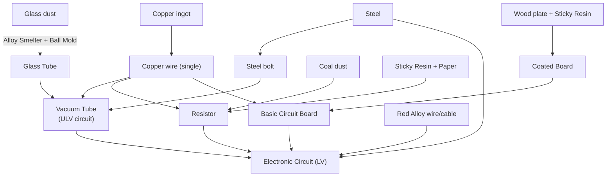
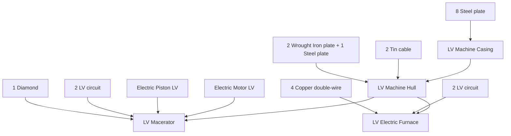
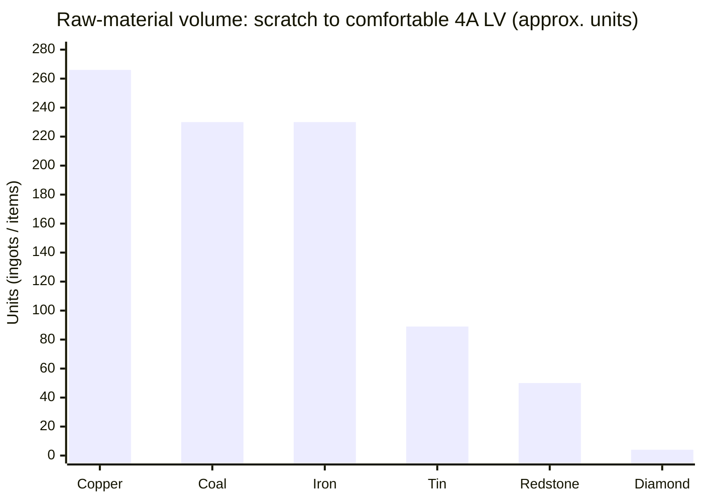
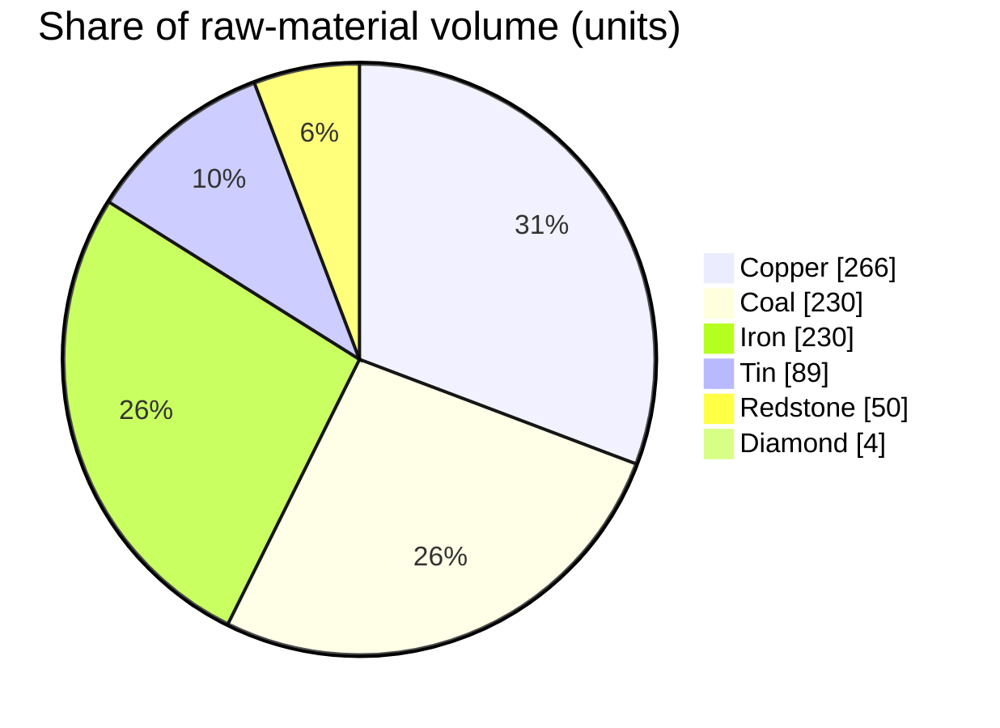
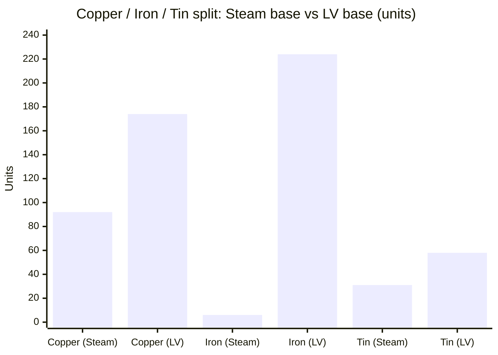
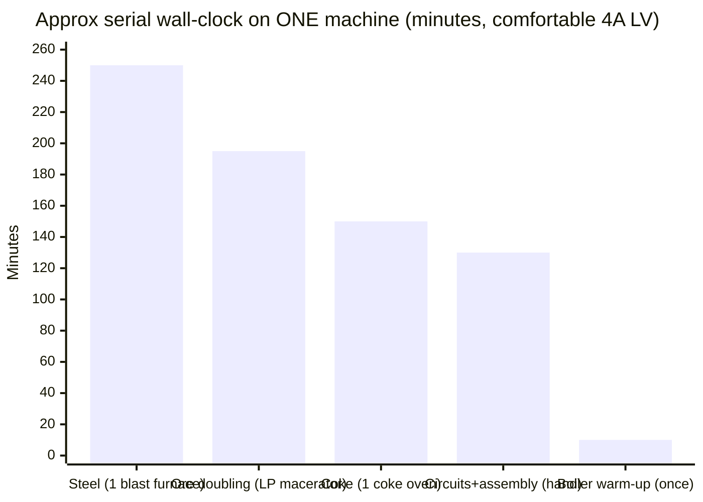

# Steam → LV Progression (GregTech CEu Modern)

> Reference for the steam-age rework. Every recipe / number below is extracted from the
> **GTCEu Modern `7.5.3`** sources (the exact version pinned in `gradle.properties`), so it
> matches what actually ships in this pack. Where a machine and a hand recipe both exist,
> both are noted.
>
> Units: `M` = 1 ingot-worth of material, `L` = 144 mB fluid. Voltages: `ULV = 8V`, `LV = 32V`.

---

## 0. The goal, in one sentence

Turn raw ore into a **self-powered LV base**: mine → hand-tools → **Bronze** → **Coke Oven + Steel**
→ **Steam boiler** → **steam machines** (which double your ore) → build the **LV bridge**
(circuits + machine hulls) → light a **generator** → run **LV electric machines** off EU.

Steam machines are the workhorse of the whole middle: they run on steam (no EU, no cables) but
are **hard-capped at LV-tier recipes** and never parallelize. They exist only to bootstrap you to
the point where you can make circuits and a generator.

---

## 1. Master progression



The five highlighted nodes are the real gates: **Bronze**, **Steel**, **Steam**, **first Circuit**,
**first Generator**. Everything else is plumbing between them.

---

## 2. Stage 0 — Hand tools & Bronze

### Tools (crafting table, need a Flint/Iron tool head + a stick)

| Tool | Recipe | Yield |
|---|---|---|
| Mortar | `_I_ / SIS / SSS` (I = ingot/gem, S = **stone block**) | 2 ingot + 5 stone |
| Hammer | `II_ / IIS / II_` (S = stick) | **6 ingot** + 1 stick |
| File | `_P_ / _P_ / _S_` | 2 plate + 1 stick |
| Saw | `PPS / fhS` | 2 plate + 2 stick |
| Screwdriver | `_fS / _Sh / W__` (S = rod) | 2 rod + 1 stick |
| Wrench | `PhP / _P_ / _P_` | **4 plate** |
| Wire Cutter | `PfP / hPd / STS` | 3 plate + 2 rod + 1 screw |

`f h d w x s` in a pattern = a *tool used in place* (file/hammer/screwdriver/mallet/cutter/saw), not consumed.
Flint gives **only the Mortar**; you need Iron/Bronze/Steel (materials that have a plate) for the rest.

### Bronze

* **Composition:** `Bronze = 3 Copper + 1 Tin`.
* **Dust mixing:**
  * By hand (shapeless): `3 Copper dust + 1 Tin dust → 3 Bronze dust`
  * **Mixer** (once you have one): `3 Copper dust + 1 Tin dust + circuit#1 → 4 Bronze dust` — 25% more, use this.
* Smelt Bronze dust → Bronze ingot.

### Plates & pipes without any electric machine

| Product | Route | Cost |
|---|---|---|
| Plate (hand) | hammer over 2 ingots (`h / I / I`) | **2 ingot → 1 plate** |
| Plate (Forge Hammer, steam) | `hammer_*_to_plate` | **3 ingot → 2 plate** (1.5 ingot/plate) |
| Plate (Bender, LV) | 1 ingot + circuit#1 | 1 ingot → 1 plate |
| Small fluid pipe | hand `wXh`, X = plate | **1 plate → 1 pipe** |
| Normal fluid pipe | Extruder | 3 ingot → 1 pipe |
| Rod | file over ingot | 1 ingot → 1 rod (= ½ M) |

> Pipes are **hand-craftable from plates** — there is *no* steam extruder — so the steam tier is
> not gated behind a machine you can't yet build. It is, however, gated behind a **lot of hand-hammering**.

---

## 3. Stage 1 — Coke Oven & Steel

### Coke Oven (multiblock, no power)

* **Coke Oven Brick:** `5 Clay ball + 3 Sand + Wooden Form → 3 Compressed Coke Clay`, then **smelt** → Coke Oven Brick.
* **Coke Brick Casing:** 4 Coke Oven Brick (2×2). Multiblock is a **3×3×3 shell** of casing + a controller (`4 casing + 4 Iron plate`).
* **Outputs (per op):**

| Input | Output | Time |
|---|---|---|
| 1 Coal | **1 Coke + 500 mB Creosote** | 900 t |
| 1 Log | 1 Charcoal + 250 mB Creosote | 900 t |
| 1 Coal block | 1 Coke block + 4500 mB Creosote | 8100 t |

### Steel — Primitive Blast Furnace (the steam-era steel maker)

Multiblock of **Fireclay Brick casing** (`CASING_PRIMITIVE_BRICKS` = 4 Fireclay Brick), primitive, no EU.

| Recipe | Time |
|---|---|
| 1 Iron ingot + **1 Coke** → 1 Steel | **1500 t** (cheapest) |
| 1 Iron ingot + 2 Coal → 1 Steel | 1800 t |
| 1 Iron ingot + 2 Charcoal → 1 Steel | 1800 t |
| (Wrought Iron variants are faster: +1 Coke = 600 t) |

> **Rework flag:** at ~1500 t (75 s) per ingot, entering LV (~50 steel) is **>1 hour** of serial
> blast-furnace time, and a comfortable 4 A base (~200 steel) is **~4 hours** on a single furnace.
> Players build a *wall* of these, or the pack accelerates it — the single biggest time-sink on the path (see §9).

---

## 4. Stage 2 — Steam Power

All boilers: **16,000 mB water in / 16,000 mB steam out**, produce **0 steam below 100 °** and heat
up while burning fuel. Two pressures per boiler: **LP (Bronze)** and **HP (Steel)**.

### Boiler crafts & output

| Boiler | LP recipe | Steam out (LP / HP) |
|---|---|---|
| **Solid** (coal) | `PPP / PwP / BFB` = 5 Bronze plate + 2 Bricks + 1 Furnace | **120 / 300 mB/s** |
| **Liquid** (lava) | `PPP / PGP / PMP` = 7 Bronze plate + 1 Glass + 1 Bronze-Bricks Hull | **240 / 600 mB/s** |
| **Solar** | `GGG / SSS / PMP` = 3 Glass + 3 Silver plate + 2 Bronze pipe + Hull | **120 / 360 mB/s** |

* **Fuel:** solid fuels burn for their vanilla furnace-time (1 coal ≈ 1600 t of boiler runtime, leaving ash);
  lava = 100 mB → 900 t; creosote = 250 mB → 350 t. HP boilers burn fuel **2× faster** for 2.5–3× the steam.
* **Danger:** running dry while hot then refilling = **explosion**. Vent surplus steam or add a valve.

### Steam economics (the number that matters)

A steam machine simulates an EU machine and pays **~2 mB steam per recipe-EU** at either pressure:

* **LP** = 1 mB/EU but runs at **½ speed** → `2·EU·duration` mB total
* **HP** = 2 mB/EU at **full speed** → `2·EU·duration` mB total

So **HP buys speed, not efficiency**, at the cost of double flow and double venting damage (LP 6 / HP 12 to nearby mobs).
A full 16,000 mB steam tank ≈ **8,000 EU** of work.

> The single-block boilers above are the *bootstrap*. For real throughput there are **Large Boiler
> multiblocks** (Bronze / Steel / Titanium / TungstenSteel) doing **16,000 / 36,000 / … mB/s** — see §7 for
> how many boilers, coke ovens, and how much coal/coke it takes to sustain a 4 A LV base.

---

## 5. Stage 3 — Steam Machines

Built on a **Bronze Hull** (`PPP/PhP/PPP` = 8 Bronze plate) or **Bronze-Bricks Hull** (5 Bronze plate + 3 Bricks).
Each does exactly what its LV electric twin does, capped at LV recipes.



| Steam machine | Does | Bronze recipe (besides hull) |
|---|---|---|
| **Macerator** | ore → **2 dust** | 2 Diamond + 4 Bronze small pipe + 2 Piston |
| **Furnace** | smelting | 7 Bronze small pipe + 1 Furnace |
| **Compressor** | plates/blocks | 6 Bronze small pipe + 2 Piston |
| **Forge Hammer** | ingot → plate cheaply | 6 Bronze small pipe + 1 Piston + 1 Anvil |
| **Extractor** | rubber, cells, etc. | 6 Bronze small pipe + 1 Piston + 1 Glass |
| **Alloy Smelter** | Bronze/alloys + Glass Tubes | 6 Bronze small pipe + 2 Furnace |

> **Rework flag:** the **Steam Macerator costs 2 Diamonds** — the earliest hard gate in the pack, since
> ore-doubling is what makes everything else affordable. HP (Steel) versions are crafted *from* the built
> LP machine + Steel/Wrought-Iron plates.

The macerator, forge hammer and alloy smelter together give you **doubled dust, cheap plates, and glass
tubes** — the three things the LV bridge is built from.

---

## 6. Stage 4 — The LV Bridge

Two independent sub-trees converge here: the **circuit** and the **machine chassis**.

### 6a. Circuits (ULV Vacuum Tube → LV Electronic Circuit)



| Item | Machine recipe | Hand recipe |
|---|---|---|
| **Glass Tube** | Alloy Smelter: 1 Glass dust + Ball Mold → 1 | (also Forming Press / Solidifier) |
| **Vacuum Tube** | Assembler: Glass Tube + Steel bolt + 2 Copper wire + circuit#1 → **2** | `PTP / WWW` = 2 Steel bolt + 1 Glass Tube + 3 Copper wire → 1 |
| **Resistor** | Assembler: 1 Coal dust + 4 fine Copper wire + 100 mB Glue → **2** | `SPS/WCW/_P_` = 2 Sticky Resin + 2 Paper + 2 Copper wire + 1 Coal dust → 2 |
| **Coated Board** | — | 1 Wood plate + 2 Sticky Resin → 1 |
| **Basic Circuit Board** | Assembler: 4 Copper foil + 1 Wood plate + 100 mB Glue → 1 | `WWW/WBW/WWW` = 8 Copper wire + 1 Coated Board → 1 |
| **Electronic Circuit (LV)** | Circuit Assembler: 1 Basic Board + 2 Resistor + 2 Red Alloy wire + 2 Vacuum Tube → **2** | `RPR/VBV/CCC` = 2 Resistor + 1 Steel plate + 2 Vacuum Tube + 1 Basic Board + 3 Red Alloy cable → 1 |

> The **first** circuits are hand-crafted (the Circuit Assembler is itself an LV machine needing circuits).
> This is why copper demand explodes right before LV — see §8.

### 6b. Machine chassis (Casing → Hull → Machine)



* **LV Machine Casing** = **8 Steel plate** (crafting, `PPP/PwP/PPP`).
* **LV Machine Hull** = Casing + **2 Tin cable** + 2 Wrought-Iron plate + 1 Steel plate (crafting), or Casing + 2 Tin cable + 288 mB Polyethylene (Assembler).
* **LV machine blocks are crafting-table recipes** (no assembler needed) — LV is the lowest electric tier.

| LV machine | Extra components (all need **2 LV circuit** + Tin cables) |
|---|---|
| Macerator | 1 Motor + 1 Piston + **1 Diamond** + 3 cable |
| Electric Furnace | 4 Copper double-wire (heating coil) + 2 cable |
| Alloy Smelter | 4 Copper quad-wire (heating coil) |
| Compressor | 2 Piston |
| Extractor | Piston + Pump + 2 Glass |
| Electrolyzer | 4 Gold wire |
| **Bender** ⭑ | 2 Motor + 2 Piston + 1 Steel plate + 1 cable |
| **Wiremill** ⭑ | **4 Motor** + 2 cable |
| **Chemical Reactor** ⭑ | 1 Motor + 1 Tin rotor + 2 reactor pipe + 2 cable |
| **Lathe** ⭑ | 1 Motor + 1 Piston + **1 Diamond** + 3 cable |

⭑ = the four machines that make LV **self-sufficient** (make your own plates, wire, rods, and run chemistry). See the "comfortable LV" target in §8.

**LV electric components** (Assembler or crafting):

| Component | Recipe |
|---|---|
| **Electric Motor LV** | 2 Tin cable + 2 Steel rod + 1 **Steel-Magnetic** rod + 4 Copper wire |
| **Electric Piston LV** | 3 Steel plate + 2 Steel rod + 2 Tin cable + 1 Small Steel gear + 1 Motor LV |
| **Electric Pump LV** | 1 Tin cable + 1 Bronze pipe + 1 Tin screw + 1 Tin rotor + 2 Rubber ring + 1 Motor LV |

* **Steel-Magnetic rod** = Steel rod through a Polarizer.
* **Cables** = wire + rubber (Tin cable: 1 Tin wire + 1 Rubber plate, hand). **Tin is the canonical LV cable** (32 V, 1 A, 1 loss/block); Red Alloy is the ULV/lossless option.

---

## 7. Stage 5 — First EU & entering LV

Exactly **three** single-block generators exist, all LV/MV/HV, all **32 EU/t at LV**, all built around an **LV Machine Hull**:

| Generator | Fuel | Extra components |
|---|---|---|
| **Steam Turbine LV** | **Steam** | 2 Bronze normal pipe + 1 circuit + **2 Tin rotor** + 2 Motor LV + 1 Tin cable |
| **Combustion Generator LV** | liquid fuels (diesel, ethanol…) | 2 Piston + 1 circuit + 2 Motor LV + **2 Steel gear** + 1 Tin cable |
| **Gas Turbine LV** | combustible gas | 2 circuit + **4 Tin rotor** + 2 Motor LV + 1 Tin cable |

### The Steam Turbine bridge (recommended first generator)

```
Steam 640 mB  →  320 EU  (+ 4 mB distilled water back),  over 10 t at 32 EU/t
```

* **0.5 EU per mB steam** (2 mB steam = 1 EU) — the same rate steam machines pay, so a turbine is
  break-even vs. running steam machines directly, but it unlocks the *entire* LV electric tree.
* It reuses your existing boiler and the cheapest components (Tin + Bronze, no pistons/gears).

### Fuel energy (for reference, in an LV generator)

| Fuel | EU / mB | EU / bucket | Notes |
|---|---|---|---|
| Diesel | 480 | 480,000 | best early liquid |
| Bio Diesel | 256 | 256,000 | renewable |
| Ethanol | 192 | 192,000 | renewable, easiest |
| Light Fuel | 320 | 320,000 | distillation product |
| **Creosote** | — | — | **boiler-only** (→ steam → turbine), *not* a generator fuel in Modern |

> **Divergence from 1.12:** Creosote and Heavy Fuel do **not** burn in the combustion generator here —
> they are boiler fuels only. There is also **no** semi-fluid / thermal / magic generator.

### Batteries are optional

Generators are energy emitters that push EU straight onto the wire; **LV machines run directly off a
live generator — no battery required**. Batteries (Small Sodium 80k / Cadmium 100k / Lithium 120k EU,
made by canning 2 dust into a Battery Hull) are only for buffering or charging tools.

### Sustaining 4 A of LV — boilers, coke ovens & fuel

A **comfortable LV base runs ~4 A** (four generators, **128 EU/t**). On Steam Turbines that is
**4 × 1,280 = 5,120 mB steam/s** (256 mB/tick) that has to be produced *continuously*. Three ways to make it,
with wildly different fuel and build costs:

**Boiler steam output** (mB/s at max temp): small LP-coal 120 · **HP-coal 300** · HP-solar 360 · large-Bronze **16,000** · large-Steel **36,000**.
(Large boiler steam/s = `20 × maxTemp`; Bronze cap 800 °, Steel 1800 °.)

| Way to make 5,120 mB/s | Boilers needed | Fuel to sustain | Coke ovens *just for fuel* | Build cost |
|---|---:|---|---:|---|
| **HP (Steel) small boilers** | **~18** | **~26 coal/min** (or ~13 coke/min) | **~10** (if burning coke) | 90 Steel plate + 18 Furnace + fuel logistics |
| **1× Large Bronze Boiler** (throttled ~⅓) | **1** | **~1 coal/min** | 0 (piggyback the steel coke ovens) | 1 multiblock (~30 bronze-brick + pipe casings + firebox) |
| **HP Solar Boilers** | **~15** | **0 — no fuel** | 0 | 15 × (3 Glass + 3 Double Silver plate + Steel pipe + hull); **daylight only** |

**Fuel value = steam per item** (solid fuel lasts `burnTime ÷ 4` in a large boiler; HP small burns 2× fast):

| Fuel | HP small boiler | Large Bronze (800 °) | Large Steel (1800 °) |
|---|---:|---:|---:|
| Coal (1600 t) | 12,000 mB | 320,000 mB | 720,000 mB |
| Charcoal (1600 t) | 12,000 mB | 320,000 mB | 720,000 mB |
| **Coke** (3200 t, 2× coal) | 24,000 mB | **640,000 mB** | 1,440,000 mB |
| Creosote (250 mB, coke-oven byproduct) | ~2,100 mB | 28,000 mB | 63,000 mB |

**The takeaways for the rework:**
* **The Large Bronze Boiler collapses fuel cost.** One multiblock makes 16,000 mB/s and turns **~1 coal/min** into a 4 A supply — the "cost of sustaining steam" becomes the *one-time build*, not fuel. (It out-supplies 4 turbines 3×; throttle it, or feed ~12 turbines.)
* **The small-boiler path is the real grind:** ~18 HP boilers **plus ~10 dedicated coke ovens** to feed them (coke = 2× coal), on top of the coke ovens you already run for steel. This is where coal/coke/charcoal genuinely bites.
* **Coke is the best solid fuel** (2× coal); **Charcoal** is a renewable coal-equivalent (tree farm → coke oven). **Creosote**, the coke-oven byproduct you make while smelting steel, is essentially *free* steam fuel in a large boiler.
* **Solar** removes fuel entirely (15 HP solar boilers) but is **Silver-heavy** and **daylight-gated** — pair with a steam buffer tank or accept nightly downtime.

---

## 8. Resource calculations — "scratch → comfortable LV"

**What "comfortable LV" means here:** not just *touching* LV, but a self-sustaining base —
**~4 A of LV generation** (four generators / **128 EU/t**) plus the machines that let you make your own parts:
**Macerator, Electric Furnace, Bender, Wiremill, Chemical Reactor, Lathe**. That's **10 machine hulls**
(6 machines + 4 generators) and **16 LV circuits** — and, crucially, the **steam infrastructure** to feed
4 A continuously (§7). A big step up from merely lighting the first turbine.

Three milestones, cumulative: **A** steam base → **B** first foot in LV → **C** comfortable 4 A LV.

Assumptions: `1 ore → 2 dust` once the macerator exists; plates via Forge Hammer (1.5 ingot/plate) early,
Bender (1 ingot/plate) once built; Bronze via Mixer (3 Cu + 1 Sn → 4). Numbers **approximate**, rounded up.

### Milestone A — Steam base (Bronze-dominated)

| Need | Amount |
|---|---|
| Bronze plates (47 structural + 35 pipes) | **~82 plates ≈ 123 Bronze ingots** |
| → from | **~92 Copper + ~31 Tin** (units) |
| Diamonds | **2** (steam macerator) |
| Vanilla pistons / Furnaces / Anvil / Glass / Bricks | 6 / 4 / 1 / 1 / ~8 |

### Milestone B — First foot in LV (threshold, subset of C)

Minimum to *enter* LV: **1 Steam Turbine + LV Macerator + LV Electric Furnace** (5 circuits) ≈
**~50 Steel + ~52 Copper + ~19 Tin + 1 Diamond**. Enough to run 1 A off a boiler — but not self-sufficient.

### Milestone C — Comfortable 4 A LV (self-sufficiency set)

**4 generators** + Macerator + Furnace + **Bender + Wiremill + Chemical Reactor + Lathe**. Intermediates:
**10 hulls, 16 circuits, 21 motors, 4 pistons, 9 Tin rotors, 2 Diamonds** — plus a boiler (ideally 1 Large
Bronze) to actually feed the 4 A (steam-infra materials in §7, not re-counted here).

| Need | Amount | Driver |
|---|---|---|
| **Steel** | ~119 plates + rods/bolts/gears ≈ **~200 ingots** | 10 casings = 80 plate + hulls + 21 motors + pistons |
| → costs | **~200 Iron + ~200 Coke** through the blast furnace | the dominant sink |
| Wrought Iron | ~20 plates (~24 iron) | 10 hull plates |
| **Copper** | **~174 ingots** | 340 single wire — **circuits are ¾ of it** |
| **Tin** | **~58 ingots** | 87 cables (22) + 9 rotors (36) |
| Red Alloy | ~48 cables | 16 circuits' wiring |
| Diamond | **2** | Macerator + Lathe grinders |
| Circuit sub-parts | 32 Vacuum Tubes, 32 Resistors, 16 Boards, 32 Glass dust | 16 LV circuits |

### Grand total from scratch → comfortable 4 A LV (A + C, with ore-doubling)

| Raw material | ~Units | ~Ore to mine |
|---|---|---|
| **Copper** | ~266 | **~133 ore** |
| **Coal** | ~230 | coke for steel + boiler fuel + dust |
| **Iron** | ~230 | **~115 ore** |
| **Tin** | ~89 | **~45 ore** |
| **Redstone** | ~50 | red alloy + pistons |
| **Diamond** | **4** | 2 steam-mac + 1 LV-mac + 1 lathe |
| Wood / Sticky Resin / Rubber | moderate | boards, resistors, cables |

> Fuel to *run* the base (not in the table): on a **Large Bronze Boiler** ≈ **1 coal/min**; on **~18 HP small
> boilers** ≈ **26 coal/min + ~10 extra coke ovens** (see §7). The boiler choice dwarfs every other ongoing cost.

### Resource requirement by volume

Total crafted units needed (grand-total table), largest to smallest:



Share of total material volume — Copper alone is ~⅓ of everything you craft:



Where each metal is spent, Steam base (A) vs LV base (C):



The steam base is **Bronze (copper+tin)**-heavy; the LV base flips to a **massive iron/steel demand** (10 hulls) plus a **second copper spike from circuits**.

**Reading of the numbers:**
* **Steel is the headline.** A 4 A + 6-machine base needs **~200 steel** (10 eight-plate casings alone = 80 plates). That is a *throughput* problem — see the time budget in §9.
* **Copper is still the tax.** **~¾ of all copper is circuit sub-parts** (boards + vacuum tubes + resistors), hand-crafted because the Circuit Assembler is itself LV. An earlier/cheaper circuit is the highest-leverage material change.
* **Diamonds (×4)** gate ore-doubling twice (steam + LV macerator) and the lathe.
* **Tin stays cheap** (~45 ore) but load-bearing — the only LV cable, plus every motor/rotor.
* **Fuel is a *build* choice, not a material line** — one Large Bronze Boiler makes 4 A nearly free; small boilers turn it into a coke-oven farm (§7).

> **The material counts above are only half the story.** Every hand recipe also burns **tool
> durability**, and every machine recipe burns **time**. Both decide whether a player should tool-craft
> or machine-craft each step — see §9.

---

## 9. Time & tool economy (hand vs machine)

The raw-material tally hides two costs that actually shape how the steam age *plays*: **hand recipes wear
out tools** (and eventually cost you the metal to re-make them + real player-time swinging), while
**machine recipes cost time and steam/EU** but scale and automate. Every plate, wire, rod and pipe on the
path can be made *either* way — this section is the data to choose.

### 9a. Tool durability (crafting tools)

Formula (from `IGTTool` / `MaterialToolTier`): **max durability = material durability × material multiplier
× tool-type multiplier**. Crafting tools (hammer/file/saw/wrench/screwdriver/mortar/wire-cutter) all have
tool-type multiplier **1.0** and the base materials have material multiplier **1**, so **durability = the
material's raw number**, and each *craft* subtracts a fixed **damage-per-craft**:

| Material | Durability | Harvest lvl |
|---|---|---|
| Flint | 64 | 1 |
| Bronze | 192 | 2 |
| Iron | 256 | 2 |
| Wrought Iron | 384 | 2 |
| Steel | 512 | 3 |

| Crafting tool | Damage / craft | **Crafts per Bronze (192)** | **per Steel (512)** |
|---|---:|---:|---:|
| Wrench | 1 | 192 | 512 |
| Hammer | 2 | 96 | 256 |
| Saw | 2 | 96 | 256 |
| Mortar | 2 | 96 (Flint: 32) | 256 |
| File | 4 | 48 | 128 |
| Screwdriver | 4 | 48 | 128 |
| Wire Cutter | 4 | 48 | 128 |

### 9b. What each hand step costs in tool wear

| Hand recipe | Tool(s) used | Wear per craft |
|---|---|---|
| Ingot → 1 plate (`h/I/I`) | Hammer | **2** |
| Plate → small pipe (`wXh`) | Wrench + Hammer | 1 + 2 |
| Ingot → 1 rod (`f/X`) | File | **4** |
| Plate → 1 wire (`Xx`) | Wire Cutter | **4** |
| Ingot/gem → dust (Mortar) | Mortar | 2 |
| Screws / bolts, board etch, etc. | Screwdriver / File | 4 |

**Full-hand path, rough churn** (numbers from §8):

* **Bronze era** — 82 plates + 35 pipes ≈ **117 hammer-crafts → ~234 damage → ~2 Bronze hammers** (192 each), i.e. ~12 extra Bronze ingots just in worn-out hammers, plus every swing done by hand.
* **Circuit era (comfortable 4 A LV)** — hand-making the **~340 Copper wires** for 16 circuits = 340 × 4 = **~1,360 wire-cutter damage ≈ 2.7 Steel wire-cutters** (512 each) for the circuit copper *alone*; the ~70 motor/piston rods burn a File (128 uses on Steel) about the same. This is the loudest signal to **build the Wiremill early**.

> Takeaway: a **Steel** tool set (wrench 512 / hammer 256 / file 128) survives most of the run; **Flint/Iron**
> tools (mortar 32 / hammer 128) are strictly bootstrap. But hand-making *wire and plate in bulk* churns
> tools fast — those are exactly the two things the **Wiremill / Forge Hammer machines do with zero wear**.

### 9c. Machine processing time

Durations are at **base LV**. A **steam LP machine runs at ½ speed (2× duration)**; an electric machine at
**MV+ overclocks (½ duration per voltage tier)**. So the same recipe can be 4× slower on LP steam than on MV.

| Conversion | Machine | Duration (base) | vs hand |
|---|---|---|---|
| Ore → 2 crushed (doubling) | Macerator | 400 t (20 s) · **LP steam 40 s** | hand can't double |
| Crushed → dust | Macerator | 400 t | Mortar, 2 wear |
| 3 ingot → 2 plate | Forge Hammer | ≈ mass, ~3 s | hand 2 ingot→1 plate, 2 wear |
| 1 ingot → 2 wire | Wiremill | ≈ mass, ~3 s | hand plate→1 wire, 4 wear |
| 1 ingot → small pipe | Extruder | ≈ mass | hand plate→pipe, 3 wear |
| Glass dust → Glass Tube | Alloy Smelter | 160 t (8 s) | — |
| Vacuum Tube / Resistor | Assembler | 120 / 160 t | hand, no wear |
| Electronic Circuit LV | Circuit Assembler | 200 t (10 s) | hand, 0 wear but LV-gated |
| Coal → Coke | Coke Oven | **900 t (45 s)** | — |
| Iron + Coke → Steel | Primitive Blast Furnace | **1500 t (75 s)** | — |

### 9d. The wall-clock reality — steel and ore doubling dominate

Approximate **serial** time on a *single* machine to reach comfortable 4 A LV (from §8 volumes):



* **Steel:** ~200 ingots × 75 s in one **Primitive Blast Furnace** ≈ **~4.2 hours**, with coke (~45 s each) pipelined alongside (~150 min on one coke oven). **Parallel-scalable** — 8 blast furnaces ≈ **31 min** — so steel is purely a *throughput/build-out* problem, not a recipe one. For a 4 A base you **must** build a wall of furnaces.
* **Ore doubling:** ~293 macerator ops (Cu 133 + Fe 115 + Sn 45) × ~40 s on an **LP steam macerator** ≈ **195 min**. An **LV macerator** (20 s, no ½-speed) halves it; MV+ overclock quarters it — rushing the electric macerator (and building several) beats any recipe tweak.
* **Boiler warm-up:** an LP boiler gains +1 °/24 t, produces nothing < 100 °, and maxes at 500 ° after ~**10 min** — a one-time tax each time it goes cold. (A Large Bronze Boiler at heatSpeed 1 warms to 800 ° in ~40 s of continuous firing.)
* **Circuits & assembly** (~130 min) are mostly *player-time* hand-crafting, until the Circuit Assembler exists.

**Bottom line:** comfortable 4 A LV is a **multi-hour factory build**, dominated by **steel throughput** and **ore
doubling** — not material scarcity, and *not* fuel once a Large Bronze Boiler is up. The winning play:
**hand-tool only the first Forge Hammer + Macerator, then mass-produce hulls via machines and duplicate the
two slow multiblocks** (blast furnace + macerator). Tool-focus past the bootstrap just trades machine-time
for tool-churn and player-time.

---

## 10. Levers for the rework (where to aim)

| Lever | Current behavior | Effect if changed |
|---|---|---|
| Steam Macerator diamond cost | 2 Diamonds before any ore-doubling | Biggest early wall; softening it accelerates the whole tier |
| Ore-doubling throughput | LP macerator ~40 s/ore, ½ speed, single-recipe | The 2nd time sink (~195 min for a 4 A base); faster steam mac or cheaper LV mac is high-impact |
| Circuit copper cost | ~340 single wires by hand for 16 circuits (¾ of all copper) | Dominant *material* grind + ~2.7 Steel wire-cutters of wear |
| Steel volume for hulls | 10 hulls = 80 casing plates; ~200 steel for comfortable 4 A | **The** headline cost; casing plate count or a cheaper hull reshapes the whole tier |
| Primitive Blast Furnace speed | 1500 t/ingot, serial (~4.2 h for 200 on one) | Main steel time sink; parallel-scalable, so also a build-cost lever |
| **Large Bronze Boiler efficiency** | 16,000 mB/s, ~320k mB steam/coal (~1 coal/min for 4 A) | Collapses fuel cost to ~0; steam "cost" becomes the one-time build. Nerf output/temp if steam should stay a sink |
| Small-vs-large boiler gap | HP small 300 mB/s vs large Bronze 16,000 mB/s (~53×) | The cliff that makes ~18 small boilers + ~10 coke ovens pointless once you can build one multiblock |
| Tool durability / damage-per-craft | File/cutter = 4, hammer = 2; Bronze 192 / Steel 512 | Cheaper/tougher tools shift the hand-vs-machine crossover |
| Steam machine cap | LV recipes only, no parallel | Keeps steam a bootstrap, forces the LV jump |
| Steam efficiency | ~2 mB/EU, LP=HP | HP only adds speed; no efficiency reward for progressing |
| Generator variety | 3 generators, no semi-fluid/thermal | Creosote/solid fuels must route through a boiler |

*All recipes, durabilities and durations verified against GTCEu Modern 7.5.3 source (`com.gregtechceu.gtceu`).*
